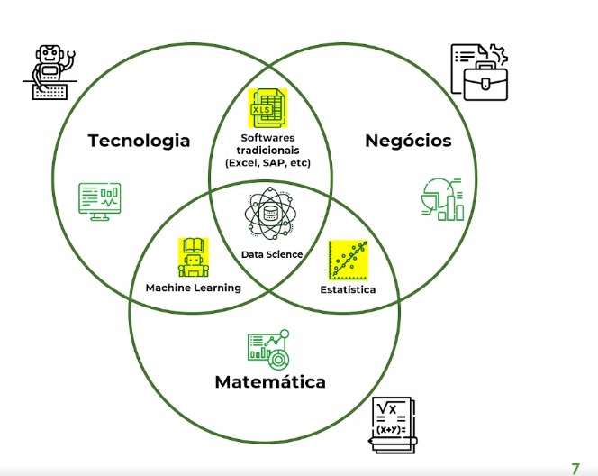

<h3>O que é ciência de dados?</h3>

É uma área interdisciplinar que utliza ciência da computação, métodos científicos, estatística, algoritmos, processos e sistemas para extrair ou extrapolar conhecimento a partir de dados de diversos tipos, sendo eles potencialmente ruidosos, estruturados ou não-estruturados.

 

<h5>A Interdisciplinaridade da ciência de dados:</h5>

Ciência de dados envolve estas 3 áreas: Matemática, Tecnologia e Negócios.

( Isso explica um pouco das diferentes opiniões que lemos ou ouvimos de profissionais da área de ciência de dados, a perspectiva pode influenciar nisso)