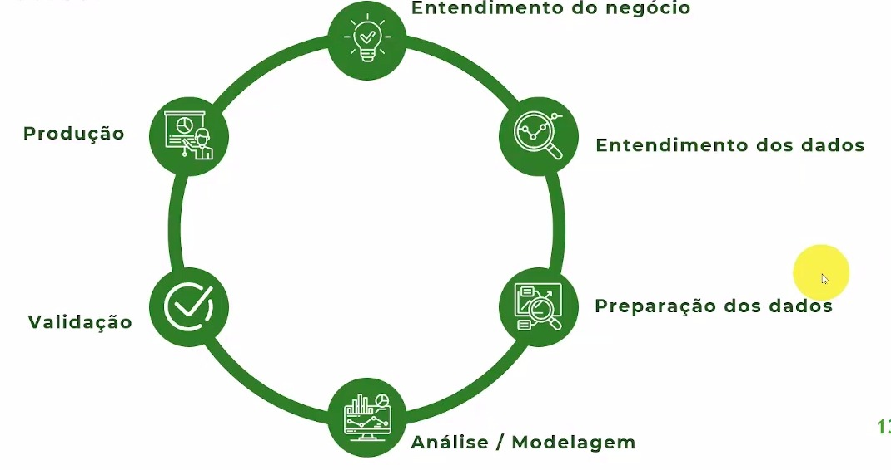

 <h3>O CRISP-DM (Cross Industry Standard Process for Data Mining) é uma metodologia que rege 6 etapas para áreas que trabalham com dados, são elas:</h3>

 
 

Entendimento do Negócio (Business Understanding):
 

Para <b>qualquer</b> projeto que lida com dados o primeiro passo é a compreensão do negócio. Nesta etapa definimos a meta do projeto alinhados com o objetivo estratégico da organização.

 
 

Compreensão dos Dados (Data Understanding):
 

Uma vez entendido, precisamos saber quais dados gerados pelo negócio são de fato relevantes para o propósito. Nesta etapa exploramos as informações identificamos as lacunas, problemas e podemos trabalhar em uma adequação para estes casos (se possível).

 
 

Preparação dos Dados (Data Preparation):
 

A tendência na esmagadora maioria dos casos é que o negócio gere dados brutos que evidentemente não são uteís para o propósito. Nesta etapa vamos trabalhar com a limpeza, extrair as informações que de fato são uteís para as etapas subsequentes.

 
 

Modelagem (Modeling):
 

A fase de modelagem envolve a aplicação de técnicas e algoritmos de modelagem de dados aos dados preparados. Selecionamos as técnicas mais adequadas, como regressão, classificação ou agrupamento, e ajustamos e avaliamos os modelos para garantir sua precisão e eficácia.
(texto extraído de https://medium.com/blog-do-zouza/metodologia-crisp-dm-uma-abordagem-abrangente-para-projetos-de-dados-d7e7135b907e)

 
 

Validação (Validation):
 

Aqui vamos verificar se a modelagem feita (etapa anterior) está de fato alinhada com o propósito, consideremos esta uma etapa de teste onde confirmamos que nosso modelo desenvolvido está correto.

 
 

Produção (Production):
 

A ultima etapa é a publicação do nosso modelo, onde depois de validado vamos disponibiliza-lo para uso e monitora-lo.

