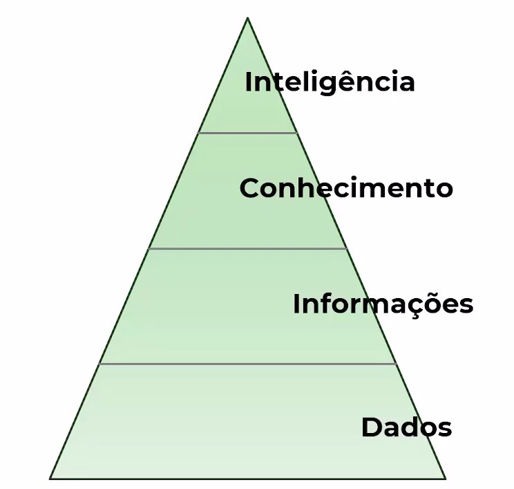

É sempre importante lembrar/saber que existe uma diferença entre Dados e Inteligência (de negócios).

Dados são informações produzidas a todo tempo e podemos facilmente visualiza-las, mas a maneira como vamos explorar isso (se bem aplicada) pode se tornar a inteligência.

 
 

Se fossemos falar de maneira cronológica teríamos:

 
 

Dado --> Informação --> Conhecimento --> Inteligência

O `dado` é produzido, a partir dele eu tenho uma `informação`, com essa informação eu passo a ter `conhecimento` para depois tomar decisões com base neste e tomar decisões `inteligentes` para o meu negócio.

 
 

